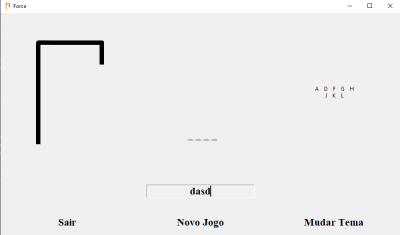
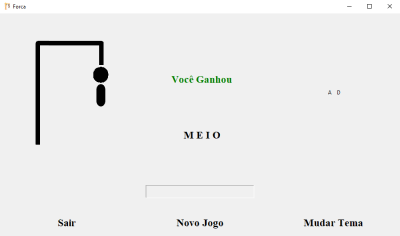
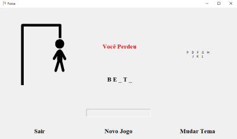
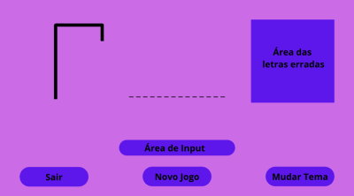
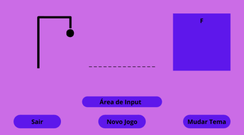
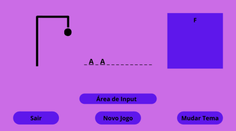
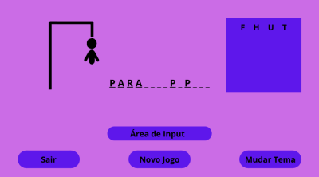
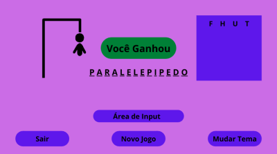
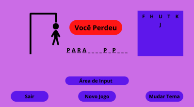

# Jogo da Forca

### Prints do app (ainda não funcional)

 &nbsp; 

 &nbsp; 

##

### Imagens da ideia (criadas no [Canva](https://www.canva.com/))

 &nbsp; 

 &nbsp; 

 &nbsp; 

O Jogo não necessáriamente seguirá essas cores e terá vários temas para alternar entre eles e decidir qual usar.

##

### Linguagens e Bibliotecas usadas até o momento:

- Python
- Tkinter
  - Criar a interface gráfica do aplicativo.
- Pandas
  - Banco de Dados que ainda está na maquina.
- Urllib3
  - Verificar se uma palavra existe pegando o HTML de um site de dicionários.

##

### Descrição detalhada do Jogo

Clássico Jogo da Forca com palavras e um boneco sendo enforcado, sendo necessário acertar a palavra, chutando algumas letras, para salvar ele de morrer. No jogo clássico uma dica é mostrada: uma palavra que tem uma forte relação com a palavra a ser advinhada. Exemplo: se a palavra a ser advinhada for **Manga** a dica poderia ser **Fruta**. 

##

  
<h2>README in English</h2> <h4>- Not my first language</h4>

 <h3>Languages and Libraries used so far:</h3>

- Python
- Tkinter
  - Create the graphic interface of the app.
- Pandas
  - Database, on the machine for now.
- Urllib3
  - Check if a word exists, get the HTML from a dictionary site.

##

<h3>Detailed descripcion of the game</h3>

  Classic Hangman (game) with words and a man being hang, all you need is to guess correctly the word, suggesting letters within a certain number of guesses, to save the man. In the classic game a tip is given (on the brazilian version at least), the tip is a word that has a strong relationship with the word to be guessed. e.g. if the word to be guessed is **Strawberry**, the tip may be **Fruit**.
  

